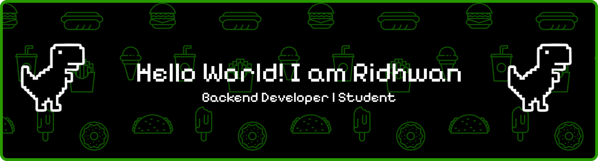

## Hi there 👋

<!--
**Ridhwan077/Ridhwan077** is a ✨ _special_ ✨ repository because its `README.md` (this file) appears on your GitHub profile.

Here are some ideas to get you started:

- 🔭 I’m currently working on ...
- 🌱 I’m currently learning ...
- 👯 I’m looking to collaborate on ...
- 🤔 I’m looking for help with ...
- 💬 Ask me about ...
- 📫 How to reach me: ...
- 😄 Pronouns: ...
- ⚡ Fun fact: ...
-->
# 💫 About Me:
 - 📖 I am currently a university student. - 🌱 I’m currently learning Backend Fundamental - 🔭 i am now looking for work experience to fix small bugs and building a backend system. 

## 🌐 Socials:
 

# 💻 Tech Stack:
         
# 📊 GitHub Stats:
 
 

# My Contribution

<picture>
  <source media="(prefers-color-scheme: dark)" srcset="https://raw.githubusercontent.com/Ridhwan077/Ridhwan077/output/pacman-contribution-graph-dark.svg">
  <!-- <source media="(prefers-color-scheme: light)" srcset="https://raw.githubusercontent.com/[USERNAME]/[USERNAME]/output/pacman-contribution-graph.svg"> -->
  
</picture>

<!-- Proudly created with GPRM ( https://gprm.itsvg.in ) -->